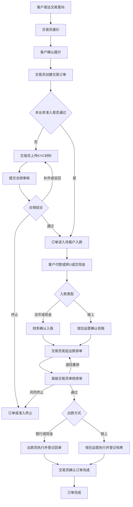
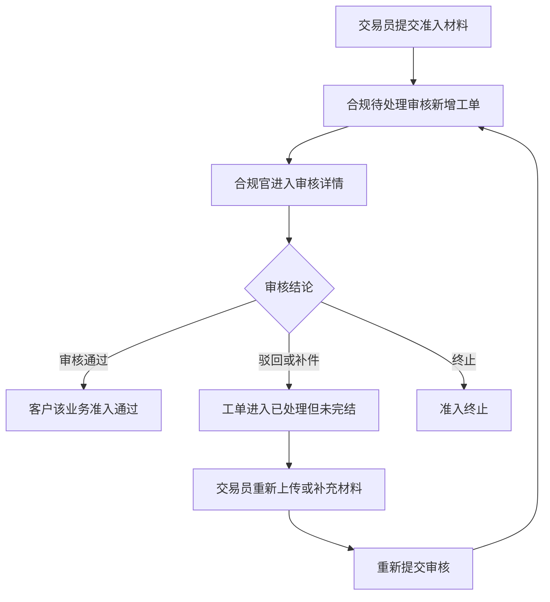
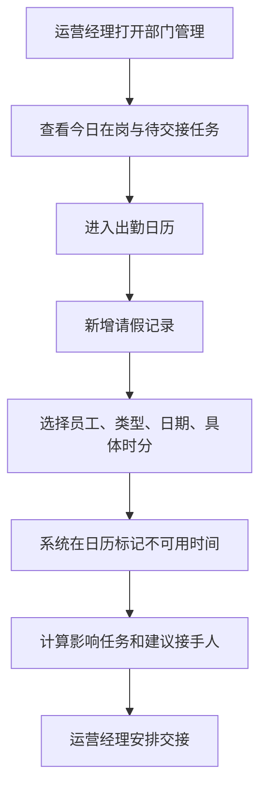

# Bitvast Trade Workbench PRD

## 1. 项目概述

### 1.1 产品名称

Bitvast Trade Workbench，交易业务工作台。

### 1.2 版本号

v1.0

### 1.3 修订记录

| 日期 | 版本 | 修改内容 | 作者 |
| --- | --- | --- | --- |
| 2026-08-26 | v1.0 | 基于当前 demo、原型讨论与状态机方案整理 PRD 初稿 | 待定 |

### 1.4 背景与目标

Bitvast 当前业务涉及报价、客户准入、KYC 材料收集与审核、客户入款确认、出款排单、出款审核、外部银行或链上执行、凭证补充、对账与员工排班交接等多个环节。当前 demo 通过多角色工作台模拟一笔交易从报价到完成的闭环，但部分模块在早期设计中存在入口分散、概念重复的问题。

本产品目标是将客户、业务准入和交易订单串联成一个可追踪、可审核、可交接的内部工作台：

- 交易员以交易订单为主线推进业务。
- 合规官以审核队列和 KYC list 配置维护准入规则与审核结果。
- 财务、钱包运营、出款员以订单中的待办节点完成入款确认和出款执行。
- 运营经理通过总览、员工出勤和任务交接提前安排人力。
- 所有关键状态变化、材料、凭证和操作结论都沉淀在客户详情和交易订单时间线中。

### 1.5 用户角色

| 角色 | 主要职责 | 当前 demo 视角 |
| --- | --- | --- |
| 初级交易员 | 报价、创建交易订单、收集客户材料、登记客户付款意向、发起出款排单 | 初级交易员 |
| 高级交易员 | 复核交易订单、审核出款排单、处理异常与重排 | 高级交易员 |
| 合规官 | 审核 KYC/准入材料、维护 KYC list 配置、查看审计日志 | 合规官 |
| 财务 | 确认法币入账、账务流水、资金库存、每日对账、盈利来源 | 财务 |
| 钱包运营 | 提供或核验链上地址、确认链上入款、登记链上出款哈希 | 钱包运营 |
| 出款员 | 根据审核通过的排单在外部银行系统执行出款，上传回单 | 出款员 |
| 运营经理 | 查看交易与资金运营总览、员工出勤、任务交接、异常监控 | 运营经理 |
| 系统管理员 | 配置规则、权限、全局审计与系统基础设置 | 系统管理员 |

## 2. 功能需求列表

| 模块 | 功能点 | 描述 | 优先级 |
| --- | --- | --- | --- |
| 全局框架 | 角色切换 | 可在 demo 中切换初级交易员、高级交易员、合规官、财务、钱包运营、出款员、运营经理、系统管理员视角 | P0 |
| 全局框架 | 顶部搜索 | 支持按客户、案件编号、交易编号搜索，具体检索范围按当前页面上下文变化 | P0 |
| 全局框架 | 左侧导航 | 根据角色展示对应模块，避免无权限角色看到无关操作入口 | P0 |
| 工作台 | 角色待办 | 按当前角色聚合待处理事项、异常提醒、今日任务 | P0 |
| 客户管理 | 客户列表 | 展示直客、中介、中介下级客户，支持搜索、筛选、分页 | P0 |
| 客户管理 | 客户生命周期状态 | 列表主状态展示新客户、活跃、沉睡、暂停合作 | P0 |
| 客户管理 | 中介层级 | 中介客户可展开查看下级客户，下级客户也可打开详情抽屉 | P0 |
| 客户管理 | 新建客户 | 支持新建直客、中介、中介下级客户，支持录入编号、名称、地区、电话、所属交易员、备注等 | P0 |
| 客户管理 | 编辑客户 | 编辑表单参考新建客户表单，支持直客转换为中介或中介下级，并可为客户选择所属中介 | P0 |
| 客户详情 | 侧边抽屉 | 展示客户概览、材料、申请、交易与凭证、时间线 | P0 |
| 客户详情 | 业务准入状态 | 在客户详情中按业务类型和渠道展示 KYC/准入申请状态 | P0 |
| 报价管理 | 快速报价 | 交易员根据业务类型、币种、渠道等进行单笔报价 | P0 |
| 报价管理 | 批量报价 | 支持批量客户或批量报价场景的演示入口 | P1 |
| 报价管理 | 往期报价 | 查询历史报价记录，便于关联交易订单 | P1 |
| 交易订单 | 创建订单 | 客户有交易意向后，由交易员创建订单，并同步展示客户当前业务准入状态 | P0 |
| 交易订单 | 订单列表 | 按我的交易、待 KYC、待客户入款、待排单、被退回等维度筛选 | P0 |
| 交易订单 | 订单详情抽屉 | 展示订单金额、汇率、客户信息、KYC 状态、业务推进状态、材料、付款、排单、活动 | P0 |
| 交易订单 | 状态化按钮 | 不同订单状态、不同角色展示不同主按钮和辅助按钮 | P0 |
| 业务准入 | 材料上传 | 交易员按客户、业务类型、渠道上传准入材料 | P0 |
| 业务准入 | 材料库复用 | 上传区下方支持选择客户材料库材料，加入后与本地上传材料一致，可预览、删除、关联材料项 | P0 |
| 业务准入 | 提交配置 | 支持填写业务类型、客户姓名、业务说明，选择保存材料库或提交到合规 | P0 |
| 业务准入 | KYC 规则助手 | 右侧展示当前业务类型和渠道的材料清单、规则提醒、完整度校验 | P0 |
| 合规审核 | 审核队列 | 待处理审核展示客户名称、编号、审核类型、状态、提交时间、操作 | P0 |
| 合规审核 | 已处理审核 | 审核结束后进入已处理列表，通过、驳回、终止均保留记录 | P0 |
| 合规审核 | 审核详情 | 合规官查看材料、风险依据，执行通过、驳回并填写原因、终止 | P0 |
| 合规配置 | KYC list 配置 | 按业务类型、渠道、材料项三层配置准入材料模板 | P0 |
| 合规配置 | 材料项编辑 | 支持添加、删除、排序材料项，配置必填、份数、文件类型、有效期 | P0 |
| 合规配置 | 渠道约束 | 支持为不同渠道维护特殊说明和限制条件 | P0 |
| 财务 | 入款确认 | 对法币或现金入款进行到账确认或驳回 | P0 |
| 财务 | 账务流水 | 展示与订单相关的资金流水 | P1 |
| 财务 | 库存管理 | 查看资金库存和通道可用额度 | P1 |
| 财务 | 每日对账 | 展示差异、待确认和已确认记录 | P1 |
| 钱包运营 | 链上入款确认 | 对客户转 U 或链上资金到账进行登记和确认 | P0 |
| 钱包运营 | 地址 KYA | 对客户收 U 地址进行 KYA 登记或核验 | P0 |
| 钱包运营 | 链上出款登记 | 执行或登记链上转账，补充交易哈希和凭证 | P0 |
| 高级交易员 | 出款排单审核 | 对交易员提交的排单进行审核通过、退回重排或风险终止 | P0 |
| 出款员 | 出款任务 | 对审核通过的银行或现金出款任务执行出款登记 | P0 |
| 出款员 | 凭证匹配 | 补充回单、哈希或凭证信息 | P1 |
| 排单中心 | 排单配置 | 早期独立排单视图，展示待排单订单、可用通道额度和操作入口 | P1 |
| 部门管理 | 员工概览 | 统计员工今日任务、待办、超时、角色分组 | P0 |
| 部门管理 | 出勤日历 | 展示员工请假、外出、培训等不可用时间，支持今天标记和 hover 查看时间段 | P0 |
| 部门管理 | 请假记录 | 运营经理手动登记请假记录，支持时分级时间段 | P0 |
| 部门管理 | 任务交接 | 根据角色、在岗状态、待办数量推荐接手人 | P0 |
| 审计日志 | 操作记录 | 记录关键动作、操作者、时间、对象和结果 | P0 |

## 3. 页面流程图与用户操作流程

### 3.1 核心交易闭环

### 3.2 合规审核流程

### 3.3 部门管理与请假交接流程

## 4. 界面详细说明

### 4.1 全局框架

页面元素：

- 左侧深色导航，展示 Bitvast 标识、角色可访问模块、角标待办数、重置演示数据入口。
- 顶部搜索框，支持输入客户、案件编号或交易编号。
- 顶部角色选择器，切换 demo 角色视角。
- 用户信息区，展示头像缩写、姓名、岗位和编号。

交互逻辑：

- 切换角色后，左侧导航和页面内容按角色权限变化。
- 点击导航项进入对应模块。
- 重置演示数据会恢复内置 demo 数据，需避免误删用户新增的关键演示数据，具体策略待确认。

### 4.2 工作台

页面元素：

- 当前角色待办摘要。
- 近期任务卡片。
- 异常或提醒入口。
- 关键指标卡片。

交互逻辑：

- 不同角色看到不同工作台指标。
- 点击待办可跳转到对应模块或打开详情抽屉。

### 4.3 客户管理

页面元素：

- 标题区：客户管理说明。
- 搜索框：客户名称、编号、交易员。
- 筛选器：客户生命周期状态、客户类型。
- 客户列表：客户名称、客户编号、客户类型/地区、当前状态、风险、负责人、最后更新、操作。
- 中介展开按钮：展开或收起下级客户。
- 新建客户按钮。
- 编辑信息按钮。

交互逻辑：

- 列表支持分页，新增客户后刷新页面不应丢失数据或减少列表数据。
- 中介客户点击展开后展示中介下级客户。
- 中介下级客户可点击打开侧边抽屉查看客户详情。
- 编辑客户时可变更客户类型，包括直客、中介、中介下级客户。
- 当客户变成中介下级客户时，需要选择所属中介。

客户生命周期状态机见 5.1。

### 4.4 客户详情抽屉

页面元素：

- 抽屉头部：客户类型、客户名称、客户编号、状态标签。
- 标签页：概览、材料、申请、交易与凭证、时间线。
- 概览：客户基本信息、负责人、风险、地区、最近动态。
- 材料：材料清单，展示文件名、上传时间、审核状态。
- 申请：按业务类型和渠道展示准入申请记录及状态。
- 交易与凭证：展示该客户关联交易订单、付款、出款与凭证记录。
- 时间线：展示客户状态、材料、审核、订单动作。

交互逻辑：

- 点击列表客户打开抽屉。
- 点击申请记录可查看该次提交材料和办理进度。
- 材料上传时间统一使用 `YYYY-MM-DD` 格式展示。

### 4.5 报价管理

页面元素：

- 快速报价、批量报价、往期报价子导航。
- 业务类型、币种、金额、渠道、客户相关输入项，具体字段以报价 iframe 原型为准。
- 报价结果和复制报价文案入口。

交互逻辑：

- 交易员报价后，如客户确认交易意向，可进入交易订单创建流程。
- 往期报价可作为订单关联报价来源。
- 当前 demo 采用 iframe 嵌入报价原型，最终是否合并为统一组件待确认。

### 4.6 交易订单

页面元素：

- 标题区：交易订单说明。
- 指标卡：进行中订单、待客户付款、待排单/出款中等。
- 状态筛选标签：我的交易、待 KYC、待客户入款、待排单、被退回等。
- 订单列表：客户、编号、交易类型、状态、KYC 状态、金额、汇率、负责人、操作。
- 订单详情抽屉：订单摘要、流程条、客户信息、报价信息、付款、排单出款、活动。

交互逻辑：

- 创建订单时选择客户，系统显示该客户在当前业务类型和渠道下的准入状态。
- 如准入未通过，订单进入待 KYC。
- 如准入已通过，订单可进入待客户入款。
- 订单详情主按钮根据业务推进状态和当前角色变化。
- 订单完成或取消后不再继续推进。

交易订单状态机见 5.3，订单按钮矩阵见 5.5。

### 4.7 业务准入, 材料上传

页面元素：

- 步骤 1：选择客户，支持输入客户编号或名称，可新建客户。
- 步骤 2：选择业务类型。
- 步骤 3：选择渠道。
- 步骤 4：客户信息与业务说明，包含客户中文姓名、客户英文姓名、业务说明/风险备注。
- 步骤 5：上传材料，支持拖拽或点击选择文件。
- 客户材料库区域：显示是否使用材料库、已选数量、从材料库添加按钮。
- 文件列表：文件类型、文件名、来源、预览、关联材料项、删除。
- 底部提交区：保存客户材料库、提交到合规（找换）、提交到合规（U 相关）。
- 右侧 KYC 规则助手：规则说明、渠道限制、材料完整度。

交互逻辑：

- 点击从材料库添加，打开材料库选择面板。
- 材料库材料添加后与本地上传材料行样式一致，只保留来源标记。
- 每个材料可关联当前 KYC list 中的一项材料要求。
- 提交到合规后生成审核工单。
- 保存客户材料库仅归档材料，不进入审核队列。

### 4.8 合规审核队列

页面元素：

- 标签页：待处理审核、已处理审核。
- 待处理筛选：客户名称/编号、审核类型、状态、时间、重置。
- 待处理列表：客户名称、客户编号、审核类型、状态待审核、提交时间、操作。
- 操作：前往审核、详情。
- 已处理列表：客户名称、客户编号、我的结论、我的审核时间、最终结论、完结时间、详情。

交互逻辑：

- 每次交易员提交审核，在待处理审核新增一条工单。
- 待处理审核类型包括新提交和驳回。
- 审核通过后进入已处理审核，最终结论为审核通过。
- 审核驳回后进入已处理审核，但最终结论为未完结，同时交易员侧可见补件或驳回待办。
- 交易员重新提交后，合规待处理审核新增工单，审核类型显示驳回。

### 4.9 合规审核详情

页面元素：

- 返回审核队列入口。
- 客户编号、客户姓名、审核类型标签、风险等级。
- 基础信息区：客户编号、审核类型、当前责任人、材料完整度。
- 人工审核要求卡片。
- 提交信息：交易类型、客户姓名、说明、提交人。
- 材料列表：文件名、状态、预览、下载、退回、通过。
- 底部或顶部审核动作：驳回并填写原因、审核通过、终止（推测）。

交互逻辑：

- 合规官可对单个材料执行通过或退回。
- 合规官可对整单给出通过、驳回、终止结论。
- 驳回必须填写原因，并可指定需补充或重传的材料。

### 4.10 KYC list 配置

页面元素：

- 左侧业务类型列表，展示内置业务模式和渠道数量。
- 业务类型编辑区：业务编号、业务名称、流程与约束说明。
- 渠道 Matrix：SGB、SINO 等渠道标签。
- 渠道限制说明：不同渠道的特殊规则、限制银行、补充说明。
- 材料模块：按模块展示材料项。
- 材料项行：序号、材料名称、说明、材料类型、必填、有效期、删除。
- 新增业务类型、新增渠道、新增材料项、保存配置、发布配置按钮。

交互逻辑：

- 第一级为业务类型，第二级为渠道，第三级为具体材料项。
- 切换业务类型后，右侧显示该业务类型下选中渠道的材料模板。
- 修改后保存配置，发布后供交易员材料上传页面实时引用。
- 前台材料上传页根据业务类型和渠道自动显示匹配清单。

### 4.11 财务相关页面

页面元素：

- 交易订单入口，聚合待确认入款订单。
- 账务流水：展示订单资金记录。
- 库存管理：展示各币种、账户、通道额度。
- 每日对账：展示账实差异、确认项、异常项。
- 盈利来源：按订单或渠道拆解收入、成本、利润。
- 费率与佣金：维护或查看费率、佣金规则。

交互逻辑：

- 财务在订单待入款确认时执行法币或现金入款确认。
- 入款确认后订单进入待出款排单。
- 当前 demo 以本地数据模拟，真实系统需对接银行流水、会计账务或资金系统，待确认。

### 4.12 钱包运营

页面元素：

- 交易订单入口，展示链上入款确认、地址 KYA、链上出款登记待办。
- 哈希与凭证模块，展示链上哈希、凭证、关联订单。

交互逻辑：

- 客户转 U 时，钱包运营确认链上资金到账。
- 需要向客户打 U 时，钱包运营登记或校验客户地址 KYA。
- 出款执行时填写链上交易哈希和凭证。

### 4.13 出款员与排单相关页面

页面元素：

- 出款任务列表：订单号、通道、出款金额、收款账户、审核意见、执行打款。
- 凭证匹配：补充银行回单、现金交付凭证或外部系统结果。
- 出款记录：查看已完成出款历史。
- 排单中心：展示待排单订单、涉及总额、今日已锁汇/已排单、通道额度。

交互逻辑：

- 高级交易员审核通过排单后，出款员看到待执行任务。
- 出款员执行外部银行系统或现金交付后，登记回单。
- 当前建议将排单、出款审核、出款执行都收敛到交易订单主线中，独立页面作为角色工作入口或报表视图保留。

### 4.14 部门管理

页面元素：

- 指标卡：今日在岗、今日不可用、今日已处理、待交接任务。
- 标签页：员工概览、出勤日历、任务交接。
- 出勤日历：按员工和日期展示在岗、请假、外出、培训等。
- 今天标记：当前日期列突出显示。
- 请假记录按钮。
- 请假登记抽屉：员工、类型、时间段、开始日期、结束日期、开始时间、结束时间、备注、任务交接提醒。
- 本周交接提醒：展示请假、外出、培训对待办任务的影响和建议接手人。

交互逻辑：

- 时间段支持全天、上午、下午、自定义时段。
- 自定义时段支持选择时、分。
- 请假标记 hover 可查看具体时间段，也可在格子内直接显示时间段。
- 点击请假标记打开详情。
- 当前 demo 支持运营经理手动登记，后续可对接 Lark/OA 请假审批接口，自动同步已通过请假记录。

## 5. 状态机定义

### 5.1 客户管理列表状态机

客户管理列表仅展示客户生命周期状态，不直接展示 KYC 状态。原因是中介可能不直接交易，且同一客户不同业务类型和渠道的准入状态不同。

| 当前状态 | 描述 | 下一状态转换事件 | 下一状态 |
| --- | --- | --- | --- |
| 新客户 | 刚建档，暂无交易 | 创建首笔交易订单 | 活跃 |
| 新客户 | 刚建档，暂无交易 | 超过设定时间无订单，例如 30/60/90 天 | 沉睡 |
| 新客户 | 刚建档，暂无交易 | 人工标记暂停维护、客户明确不合作、风险原因暂停 | 暂停合作 |
| 活跃 | 近期有订单或正在交易 | 新建订单、订单进行中、近期有成交 | 活跃 |
| 活跃 | 近期有订单或正在交易 | 超过设定时间无新订单或无成交 | 沉睡 |
| 活跃 | 近期有订单或正在交易 | 人工暂停维护、客户要求暂停、风控要求暂停 | 暂停合作 |
| 沉睡 | 长时间无交易 | 创建新订单、客户重新表达交易意向 | 活跃 |
| 沉睡 | 长时间无交易 | 人工确认不再维护、客户长期失联、风险原因暂停 | 暂停合作 |
| 暂停合作 | 人工暂停维护或不再合作 | 人工恢复维护、风险解除、客户重新确认合作 | 活跃 |
| 暂停合作 | 人工暂停维护或不再合作 | 继续保持暂停 | 暂停合作 |

### 5.2 客户详情, 业务准入状态机

该状态按客户、业务类型、渠道维度记录。例如同一客户做 A 业务已通过，做 B 业务可能仍需补充材料。

| 当前状态 | 描述 | 下一状态转换事件 | 下一状态 |
| --- | --- | --- | --- |
| 草稿 | 已保存该业务类型/渠道的准入申请草稿，但未提交 | 交易员提交材料 | 待审核 |
| 待审核 | 材料已提交，等待合规官审核 | 合规审核通过 | 审核通过 |
| 待审核 | 材料已提交，等待合规官审核 | 合规要求补件 | 待补件 |
| 待审核 | 材料已提交，等待合规官审核 | 合规审核驳回 | 审核拒绝 |
| 待补件 | 合规要求补充或修改材料 | 补充材料并重新提交 | 待审核 |
| 待补件 | 合规要求补充或修改材料 | 长时间未补件或客户放弃，交易员取消 | 已取消 |
| 审核拒绝 | 合规明确拒绝该业务准入 | 重新发起新申请 | 待审核 |
| 审核通过 | 合规对该业务和渠道准入通过 | KYC 过期、材料失效、规则变化 | 已过期 |
| 审核通过 | 合规对该业务和渠道准入通过 | 人工冻结或风控限制 | 已暂停 |
| 已过期 | 曾经通过，但有效期过期，需要重新提交 | 重新提交材料 | 待审核 |
| 已暂停 | 风控或人工暂停该业务准入 | 解除暂停且材料仍有效 | 审核通过 |
| 已取消 | 申请被取消或作废 | 重新发起申请 | 待审核 |

待确认：

- “待补件”和“审核拒绝”是否都保留，或统一为“驳回待处理”。
- KYC 有效期按材料项、业务类型还是客户整体计算。

### 5.3 交易订单, 业务推进状态机

业务推进状态表示订单从创建到完成的主流程，与 KYC 子状态分开。

| 当前状态 | 含义 | 下一状态转换事件 | 下一状态 |
| --- | --- | --- | --- |
| 待KYC | 等待本单业务准入通过 | 本单业务准入审核通过 | 待客户入款 |
| 待KYC | 等待本单业务准入通过 | 交易员取消订单 | 已取消 |
| 待客户入款 | 可以交易，等待客户 TT 付款、转 U 或交现金 | 财务或钱包运营登记客户已入款 | 待入款确认 |
| 待客户入款 | 可以交易，等待客户 TT 付款、转 U 或交现金 | 交易员取消订单 | 已取消 |
| 待入款确认 | 客户已付款登记，等待财务或钱包运营确认到账 | 财务确认法币入账或钱包确认链上到账 | 待出款排单 |
| 待入款确认 | 客户已付款登记，等待确认到账 | 财务或钱包运营驳回入款 | 待客户入款 |
| 待出款排单 | 客户入款已确认，等待交易员发起出款排单 | 初级交易员提交出款排单 | 出款审核中 |
| 待出款排单 | 客户入款已确认，等待交易员发起出款排单 | 交易员取消订单 | 已取消 |
| 出款审核中 | 出款排单已提交，等待高级交易员审核 | 高级交易员审核通过 | 待出款执行 |
| 出款审核中 | 出款排单已提交，等待高级交易员审核 | 高级交易员退回重排 | 待出款排单 |
| 出款审核中 | 出款排单已提交，等待高级交易员审核 | 风险终止或排单作废 | 已取消 |
| 待出款执行 | 排单通过，等待出款员或钱包运营执行 | 出款员执行银行出款、现金交付登记，或钱包运营链上转账登记 | 出款执行中 |
| 待出款执行 | 排单通过，等待执行 | 执行前发现账户错误、地址 KYA 失败、通道不可用 | 待出款排单 |
| 待出款执行 | 排单通过，等待执行 | 风险终止或无法执行出款 | 已取消 |
| 出款执行中 | 出款已发起，等待回单、哈希或客户确认 | 补充回单、哈希或执行凭证 | 已完成 |
| 出款执行中 | 出款已发起，等待回单、哈希或客户确认 | 执行异常，需补充或重排 | 待出款排单 |
| 已完成 | 订单闭环 | 无 | 已完成 |
| 已取消 | 订单终止 | 重新交易需创建新订单 | 已取消 |

说明：

- 当前 demo 代码中主状态为 `待KYC、待客户入款、待出款排单、出款审核中、待出款执行、已完成、已取消`。上表补充了用户讨论中更完整的 `待入款确认` 和 `出款执行中`，建议后续迭代加入。
- 付款与出款都属于资金流，但在订单主线中应拆成“客户入款”和“对客户出款”两个阶段，避免职责混淆。

### 5.4 交易订单, KYC 子状态机

KYC 子状态用于订单详情底部或客户准入区，表示该订单关联业务的准入审核进度。

| 当前状态 | 对应客户详情准入状态 | 下一状态转换事件 | 下一状态 |
| --- | --- | --- | --- |
| 待KYC | 草稿或未发起审核 | 交易员提交审核到合规 | 合规审核中 |
| 合规审核中 | 待审核 | 合规审核通过 | KYC已通过 |
| 合规审核中 | 待审核 | 合规审核驳回 | KYC被驳回 |
| 合规审核中 | 待审核 | 合规审核终止 | KYC被终止 |
| KYC已通过 | 审核通过 | 无 | KYC已通过 |
| KYC被驳回 | 待补件或审核拒绝 | 交易员重新提交审核到合规 | 合规审核中 |
| KYC被终止 | 审核拒绝或已取消 | 无 | KYC被终止 |

### 5.5 交易订单按钮矩阵

| 业务推进状态 | 初级交易员按钮 | 高级交易员按钮 | 财务按钮 | 钱包运营按钮 | 出款员按钮 |
| --- | --- | --- | --- | --- | --- |
| 待KYC | 上传材料、同步KYC结果、取消订单 | 查看订单 | 查看订单 | 地址KYA登记（如涉及链上地址） | 查看订单 |
| 待客户入款 | 登记客户已付款、取消订单 | 查看订单 | 查看订单 | 提供收U地址/地址KYA（链上入款） | 查看订单 |
| 待入款确认 | 查看订单 | 查看订单 | 确认法币入账、驳回入款 | 确认链上到账、驳回入款 | 查看订单 |
| 待出款排单 | 发起出款排单、取消订单 | 查看订单 | 查看订单 | 地址KYA登记（链上出款） | 查看订单 |
| 出款审核中 | 查看订单 | 审核通过、退回重排、风险终止 | 查看订单 | 查看订单 | 查看订单 |
| 待出款执行 | 查看订单 | 查看订单、风险终止 | 查看订单 | 登记链上转账、执行异常退回 | 执行银行出款/登记现金交付、执行异常退回 |
| 出款执行中 | 确认订单完成 | 确认订单完成 | 查看订单 | 补充哈希/凭证 | 补充回单 |
| 已完成 | 查看详情 | 查看详情 | 查看详情 | 查看详情 | 查看详情 |
| 已取消 | 重新处理/创建新订单 | 解除异常/取消订单（按权限） | 查看详情 | 查看详情 | 查看详情 |

待确认：

- 初级交易员是否允许直接“登记客户已付款”，还是只允许提交付款信息，由财务或钱包运营确认。
- `出款执行中` 是否需要显式展示，还是执行登记后直接进入已完成。

### 5.6 合规审核工单状态机

| 当前状态 | 描述 | 下一状态转换事件 | 下一状态 |
| --- | --- | --- | --- |
| 待审核 | 工单进入合规待处理队列 | 合规通过 | 已处理, 审核通过 |
| 待审核 | 工单进入合规待处理队列 | 合规驳回 | 已处理, 未完结 |
| 待审核 | 工单进入合规待处理队列 | 合规终止 | 已处理, 审核终止 |
| 已处理, 未完结 | 合规已驳回，等待交易员补件重提 | 交易员重新提交 | 待审核 |
| 已处理, 审核通过 | 已完成审核 | 无 | 已处理, 审核通过 |
| 已处理, 审核终止 | 已终止审核 | 无 | 已处理, 审核终止 |

### 5.7 员工出勤状态机

| 当前状态 | 描述 | 下一状态转换事件 | 下一状态 |
| --- | --- | --- | --- |
| 在岗 | 员工可分配任务 | 登记请假、外出、培训或 OA 同步不可用 | 不可用 |
| 不可用 | 员工在指定时间段不可分配或需谨慎分配 | 不可用时间结束 | 在岗 |
| 不可用 | 员工在指定时间段不可分配或需谨慎分配 | 运营经理取消登记 | 在岗 |

## 6. 数据需求

### 6.1 客户数据

| 字段 | 描述 |
| --- | --- |
| customerId | 客户唯一 ID |
| clientNo | 客户编号 |
| name | 客户中文名称 |
| enName | 英文或法定名称 |
| customerKind | 直客、中介、中介下级客户 |
| parentIntermediaryId | 所属中介 ID，中介下级客户必填 |
| region | 地区 |
| phone | 联系电话 |
| owner | 所属交易员 |
| followTrader | 跟进交易员 |
| lifecycleStatus | 新客户、活跃、沉睡、暂停合作 |
| riskLevel | 低风险、中风险、高风险、未评估 |
| remark | 备注 |
| documents | 客户材料库 |
| accessApplications | 业务准入申请记录 |
| trades | 关联交易订单 |
| timeline | 客户时间线 |

### 6.2 材料与材料库数据

| 字段 | 描述 |
| --- | --- |
| materialId | 材料 ID |
| customerId | 所属客户 |
| name | 文件名或材料名称 |
| category | 关联 KYC 材料项 |
| fileType | PDF、PNG、JPG、DOC 等 |
| source | 本地上传、材料库复用、系统生成 |
| uploadedAt | 上传时间，展示格式 `YYYY-MM-DD` |
| status | 待识别、待检查、已归档、被退回、已通过 |
| previewUrl | 预览地址 |
| version | 版本号 |
| mappedRequirementId | 对应 KYC list 材料项 ID |

### 6.3 KYC list 配置数据

| 字段 | 描述 |
| --- | --- |
| scenarioId | 业务类型 ID |
| scenarioCode | 业务编号 |
| scenarioName | 业务类型名称 |
| processDescription | 业务流程与约束说明 |
| channels | 渠道列表 |
| channelName | 渠道名称，例如 SGB、SINO |
| channelRestrictions | 渠道特殊规则 |
| sections | 材料模块列表 |
| itemName | 材料项名称 |
| itemDescription | 材料要求说明 |
| itemType | 文件、文本、银行账户等 |
| required | 是否必填 |
| maxCount | 份数上限 |
| validity | 有效期规则 |

### 6.4 合规审核工单数据

| 字段 | 描述 |
| --- | --- |
| caseId | 审核工单 ID |
| customerId | 客户 ID |
| customerName | 客户名称 |
| clientNo | 客户编号 |
| auditType | 新提交、驳回 |
| status | 待审核、已处理 |
| finalResult | 审核通过、未完结、审核终止 |
| submittedAt | 提交时间 |
| reviewedAt | 审核时间 |
| reviewer | 审核人 |
| riskLevel | 风险等级 |
| completeness | 材料完整度 |
| note | 交易员说明或合规意见 |
| rejectedItems | 被退回材料项 |

### 6.5 交易订单数据

| 字段 | 描述 |
| --- | --- |
| orderId | 订单编号 |
| customerId | 客户 ID |
| customerName | 客户名称 |
| clientNo | 客户编号 |
| tradeType | 业务类型 |
| channel | 渠道 |
| sellCurrency | 客户卖出币种 |
| sellAmount | 客户卖出金额 |
| buyCurrency | 客户买入币种 |
| buyAmount | 客户买入金额 |
| rate | 执行汇率 |
| quoteId | 关联报价 ID |
| businessStatus | 业务推进状态 |
| kycStatus | KYC 子状态 |
| inflowMethod | 入款方式，法币、现金、链上 |
| outflowMethod | 出款方式，银行、现金、链上 |
| fundingOwnerRole | 当前入款或出款确认责任角色 |
| dispatchId | 排单 ID |
| receiptRef | 回单或哈希引用 |
| exception | 异常信息 |
| timeline | 订单活动记录 |
| createdAt | 创建时间 |
| updatedAt | 更新时间 |

### 6.6 部门管理数据

| 字段 | 描述 |
| --- | --- |
| employeeId | 员工 ID |
| employeeName | 员工名称 |
| role | 员工角色 |
| group | 所属小组 |
| pendingCount | 当前待办数量 |
| todayDone | 今日处理数量 |
| dueToday | 今日到期任务 |
| overdue | 超时任务 |
| availabilityStatus | 在岗、不可用 |
| leaveId | 请假或不可用记录 ID |
| leaveType | 年假、病假、外出、培训等 |
| startDate | 开始日期 |
| endDate | 结束日期 |
| timePart | 全天、上午、下午、自定义时段 |
| startTime | 开始时间，精确到时分 |
| endTime | 结束时间，精确到时分 |
| source | 手动登记、Lark/OA 同步 |
| registeredBy | 登记人 |
| note | 备注 |
| handoffTarget | 建议或指定接手人 |

## 7. 非功能需求

| 类型 | 需求 |
| --- | --- |
| 权限 | 不同角色仅展示其职责范围内的模块和操作按钮，关键动作需校验权限 |
| 审计 | 客户状态、KYC 审核、订单流转、资金确认、出款执行、配置发布都需要审计日志 |
| 数据持久化 | demo 使用本地数据保存，真实系统需后端持久化，新增客户和订单刷新后不得丢失 |
| 安全 | 客户身份信息、银行账户、钱包地址、材料文件需要权限隔离、敏感信息脱敏和访问日志 |
| 文件 | 支持图片、PDF、Word 等常见材料格式，真实系统需增加病毒扫描、大小限制、版本管理 |
| 性能 | 客户列表、审核队列、订单列表应支持分页、筛选和快速搜索，千级数据量下保持流畅 |
| 兼容性 | 优先支持现代桌面浏览器，移动端适配为后续需求 |
| 可访问性 | 状态不只依赖颜色，按钮和输入框需支持键盘操作和清晰焦点状态 |
| 可配置性 | 业务类型、渠道、材料项、有效期、必填规则应由 KYC list 配置维护 |
| 集成 | Lark/OA 请假同步、银行流水、钱包链上确认、外部银行出款系统为后续集成项 |

## 8. 待确认问题

1. 交易订单是否正式加入 `待入款确认` 和 `出款执行中` 两个状态，还是继续保持当前 demo 的简化状态。
2. 初级交易员在客户付款阶段，是只登记“客户已付款”，还是可以在现金交易中直接确认交收。
3. 审核拒绝和待补件是否需要同时存在，还是统一成一个“驳回待处理”状态。
4. KYC 有效期是按材料项、业务类型/渠道，还是客户整体准入维度计算。
5. 报价模块是否继续 iframe 嵌入，还是后续合并为主应用内原生页面。
6. 排单中心、出款审核、出款任务是否完全收敛到交易订单，只保留角色化入口。
7. Lark/OA 请假同步是否作为 v1.0 范围，还是 v1.0 仅保留手动登记。
8. 真实系统中银行、钱包、财务系统的接口边界和失败重试机制待补充。
